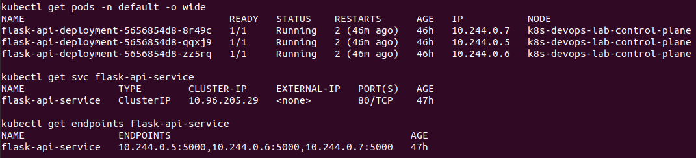
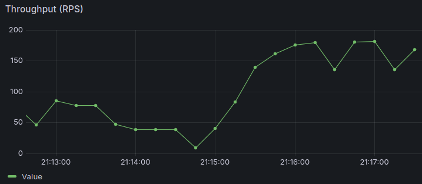

# Cloud-Native Microservice Delivery and Observability Pipeline

[](https://github.com/kindel-devops-lab/kindel-devops-lab-ci/actions/workflows/ci.yml)

Automated continuous integration, security validation, containerization, and local Kubernetes orchestration pipeline for an instrumented Python microservice.

---

## Project Overview

This repository hosts a lightweight Python microservice engineered as a telemetry harness for testing modern DevSecOps delivery cycles and resilient container orchestration.

The primary focus is not business logic complexity, but rather building a robust, auditable delivery workflow that enforces automated code quality, container security auditing, declarative deployment, and real-time observability.

---

## Architecture and Delivery Workflow

The project implements a decoupled lifecycle separating continuous delivery validation, local orchestration, and metrics monitoring:

.png)

### Delivery Stages

1. Code Quality: Python source code is evaluated with flake8 to enforce PEP8 standards and prevent structural issues.
2. Automated Testing: Unit and integration testing are executed with pytest against the virtual client endpoints.
3. Vulnerability Assessment: Aqua Security Trivy audits the compiled container image to detect Critical and High Common Vulnerabilities and Exposures (CVEs) before distribution.
4. Container Compilation: Docker builds an optimized runtime image based on python:3.10-slim leveraging layer caching.
5. Image Distribution: The validated image is delivered to a private Azure Container Registry (ACR) with an immutable tag tied to the short Git commit SHA.
6. GitOps Synchronization: The pipeline automates metadata propagation to the infrastructure repository, updating the target deployment image tag in terraform.tfvars.

---

## API Contract

The application exposes standard operational HTTP endpoints instrumented with prometheus-flask-exporter:

| Endpoint | Method | Purpose | Response Format |
|---|---|---|---|
| / | GET | Service identity and status verification | JSON |
| /health | GET | Lifecycle probes (readiness/liveness) and smoke tests | JSON |
| /metrics | GET | System and request telemetry export for Prometheus | OpenMetrics plaintext |

---

## Local Orchestration (Kubernetes via Kind)

Local deployment is managed using a multi-replica Kubernetes setup running on a local Kind cluster, ensuring zero-downtime execution and automated self-healing.

### Deployment Characteristics

* Replicas: 3 pod instances managed by a Kubernetes Deployment controller.
* Internal Routing: A ClusterIP Service distributes traffic across active pods.
* Health Checks: Integrated liveness and readiness probes verify endpoint status on /health every 10 seconds.



---

## Observability Stack (Prometheus and Grafana)

The service is fully instrumented for telemetry collection, running Prometheus and Grafana inside a dedicated monitoring namespace.

* Metrics Ingestion: Prometheus scrapes the /metrics endpoint every 5 seconds.
* Visualization: Grafana displays request rates, HTTP status distribution, and active workload health.



---

## Local Execution Guide

### Prerequisites

* Docker
* Kind
* kubectl

### 1. Build and Load Image into Kind

```bash
docker build -t devops-flask-api:v2 .
kind load docker-image devops-flask-api:v2 --name k8s-devops-lab
```

### 2. Apply Workload Manifests

```bash
kubectl apply -f k8s/deployment.yaml
kubectl apply -f k8s/service.yaml
```

### 3. Deploy Observability Infrastructure

```bash
kubectl create namespace monitoring
kubectl apply -f k8s/monitoring/prometheus-config.yaml
kubectl apply -f k8s/monitoring/prometheus-deployment.yaml
kubectl apply -f k8s/monitoring/grafana.yaml
```

### 4. Access Services Locally

Forward the API service port:
```bash
kubectl port-forward svc/flask-api-service 8085:80
```

Forward the Grafana dashboard port:

```bash
kubectl port-forward -n monitoring svc/grafana-service 3000:3000
```

* Grafana endpoint: http://localhost:3000 (Credentials: admin / admin)
* Key PromQL Throughput query: sum(rate(flask_http_request_total[1m]))
